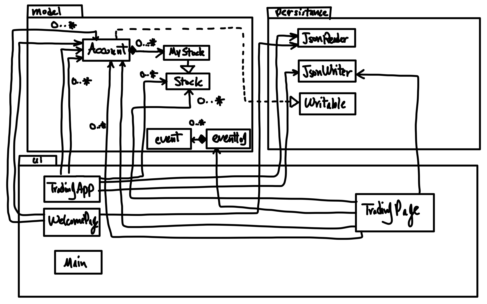

# Custom Testnet trading System

## What will the application do?
**The system is designed such that a user after creating an account
or logging in will be able to trade to equities and gain experience
in testnet before trading with real money**. The users are provided
with fake money in the beginning. *They can use it to make fictitious
trades in an offline smaller market.*

## Who will use it?
The users are individuals who will attempt to purchase equities in 
markets from the brokers in the future (can be wealth management consultants or individuals).
The distinguishing and 
important feature is that  purchase and sale of equities is 
**not** conducted real money. This is to ensure that the users
are used to such environments. Therefore, the users will use 
this as an introduction to future interactions with the 
brokers who conduct the sales of the equities in the real world.

## Why is this project of interest to you?
I have been considerably interested in finance which is the reason 
for orienting this project in such way. Traders or individuals 
who use their own TFSA or equivalent accounts could be intimidated
by the interface used by the brokers to sells equities and 
this can ease such individuals into the environment 
which is reason for my interest.

## User Stories
- As a user, I would like to be able to create an account.
- As a user, I would like to be able to buy stocks.
- As a user, I would like to be able to sell stocks.
- As a user, I would like to be able to see my current holdings.
- As a user, I would like to be able to reset my password
- As a user, I would like to be able to save all of my account information after quitting the program
- As a user, I would like to be able to **load all of my account information** after starting the program 
- As a user, I would like to have the **option of NOT loading** my saved account information 

## Instructions for grader
- *NOTE: To get to the main page (after choosing to load data or not) enter your login information or sign up with username that is not in the loaded data (if the data is loaded). You can simply sign up by using the letter b as both your username and password. Afterwards you are prompted to the main / trading page*
- **Adding a stock to List of stock (Xs to Y)**: click on the buy button. After doing so enter the ticker of the stock (valid tickers of stock that can be purchased with a new account are: ANGL and EVIL). Afterwards, enter the quantity that you want to purchase. Then click on holdings on main page to observe the addition of stock to the list of stock as it shows you the quantity, price and the stock that you purchased
- **Reducing quantity / removing a stock from list of stock in holdings (Xs to Y)**: click on sell button to sell a stock (the stock MUST be in your holdings). Enter the ticker of the stock. Enter the quantity that you want to sell (quantity <= number of shares you have in holdings). Afterwards, the number of stocks in holdings is reduced (and if quantity to be sold is equal to number of shares held then the stock will be removed from holdings)
- **The visual components can be found**: In the main page after logging in on each of the buttons and in the prompt for loading data 
- **Saving the state of application**: In the main page the application can be saved by clicking the save button
- **reloading the state of application**: Once the application is started the user is asked if they want to load the data. If you want to do so click yes to load data from the JSON file. 

## Phase 4: Task 2
- Structure of event logs:
  - event logs for Xs to Y which are buying and selling stocks:
    - [Username], bought/sold [quantity] shares of [Company Name] with the ticker [ticker]
    - Examples
      - a, bought 2 shares of Angel Corp with the ticker ANGL (adding Xs to Y)
      - a, sold 1 shares of Angel Corp with the ticker ANGL (Reducing / removing Xs from Y)
  - event logs for sufficient balance to make sure that user has enough balance to buy stocks
    - [Username], does NOT have / has sufficient balance
      - a, does not have sufficient balance
      - a, has sufficient balance

## Phase 4: Task 3
The UML diagram below shows that each class in ui (console version of the app is TradingApp class, GUI version of the app is created by WelcomePage and TradingPage class) except main calls Account twice because they have two fields that uses Account one with currentUser and one that stores a list of account. 
It is important to note that refactoring is not necessary here as the single field of account is the currentUser and the list of accounts was supposed to be used to implement a new feature / user story (which is not implemented yet) where the user would be able to log out their account and login with a different account. 
This is the reason for two fields having account and since each are associated with different functionalities / features refactoring should not happen here as this would not allow for the implementation of the feature.
With this in mind, there is no refactoring necessary to improve the design. 

